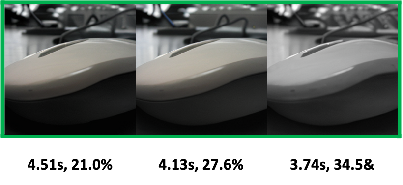
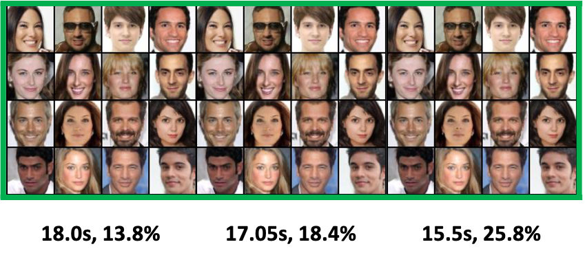
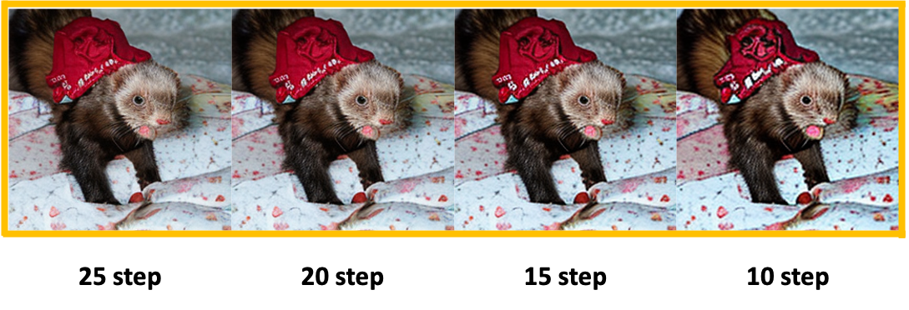

# A Simple Early Exiting Framework for Accelerated Sampling in Diffusion Models

We aim to demonstrate the qualitative comparison of the generated samples between our method and the pre-trained model, showcasing the robustness of our approach across diverse dropping schedules and few timesteps. Images enclosed within yellow boxes represent results generated by the pre-trained model, while those within green boxes depict results by our method after fine-tuning. 

## Ablation studies on diverse dropping schedules
### 1. ImageNet + DiT
#### 1.1. DDPM solver with 250step
 |
--- | --- |

#### 1.2. DDIM solver with 100step
 |
--- | --- |

#### 1.3. DPM solver with 25step
 |
--- | --- |

### 2. CelebA + U-ViT
#### 2.1. DPM solver with 50step
 |
--- | --- |

## Ablation studies on robustness of sampling steps
### 1. ImageNet + DiT
#### 1.1. DPM solver with 25, 20, 15, 10step

### 2. CelebA + U-ViT
#### 2.1. DPM solver with 20, 18, 15, 10step

## Text-to-image experiments with PixArt model
### 1. SAM + PixArt
#### 1.1 DPM solver with 20step

