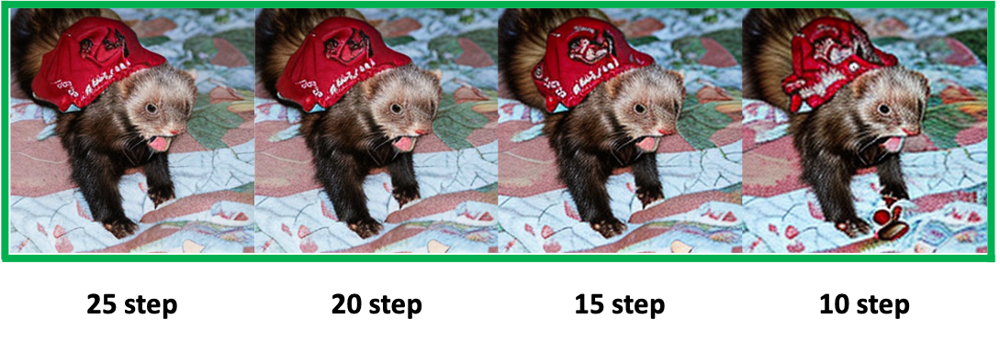

# A Simple Early Exiting Framework for Accelerated Sampling in Diffusion Models

## Ablation studies on diverse dropping schedules
### 1. Imagnet + DiT
#### 1.1. DDPM solver with 250step
 |
--- | --- |

#### 1.2. DDIM solver with 100step
 |
--- | --- |

#### 1.3. DPM solver with 25step
 |
--- | --- |

### 2. CelebA + U-ViT
#### 2.1. DPM solver with 50step

## Ablation studies on robustness of sampling steps
### 1. Imagnet + DiT
#### 1.1. DPM solver with 25, 20, 15, 10step

### 2. CelebA + U-ViT
#### 2.1. DPM solver with 25, 20, 15, 10step